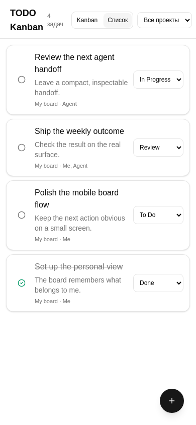
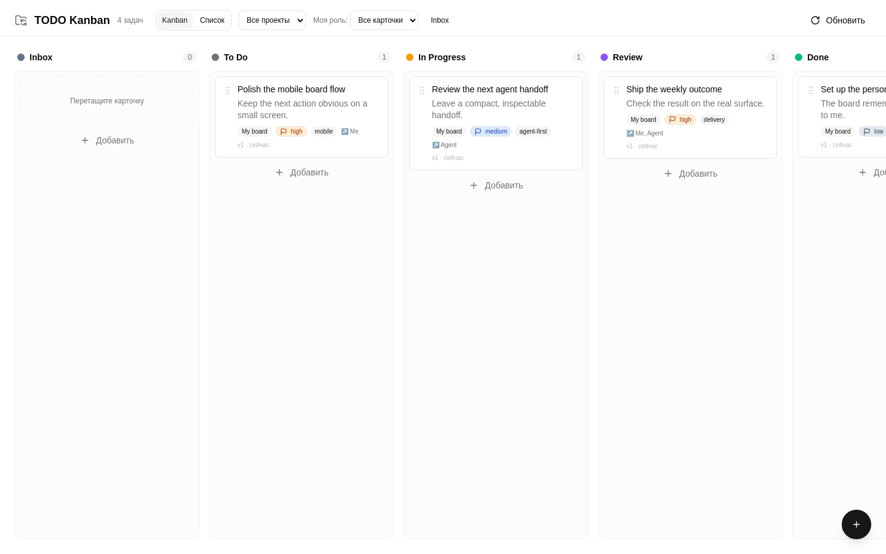

# My Kanban



There are a billion boards. This one is mine. Досок миллиарды — но эта моя.

Personal Kanban for people and agents: fast on a phone, clear on a large
screen, and backed by Markdown files you can inspect or edit directly.

## What it does

- Mobile list view and desktop Kanban with drag-and-drop.
- Project and role filters, including “show only my cards”.
- Two-way Markdown sync, stable card IDs, tags, priorities, and six columns.
- Conflict-aware edits when the UI and a file change at the same time.
- Agent-ready scoped OAuth/OpenAPI access for explicit work and personal data.



The product direction is mobile-first and agent-first. With Web Push configured,
the PWA can send subscribed devices automatic card and deadline notifications.

## Web Push configuration

The notification opt-in is explicit. A running deployment needs these
server-only environment variables; never commit the private key:

```dotenv
VAPID_PUBLIC_KEY=<public key>
VAPID_PRIVATE_KEY=<private key>
VAPID_SUBJECT=mailto:owner@example.com
```

Subscriptions are stored outside card Markdown in the configured
`PUSH_SUBSCRIPTIONS_FILE` path.

## Quick start

```bash
docker compose up -d --build
```

Open `http://localhost:3000`.

## Markdown storage

Each card is a Markdown file with YAML frontmatter:

```markdown
---
id: 'uuid'
title: 'Название задачи'
column: 'todo'
priority: 'high'
tags: ['research']
order: 0
created: '2026-08-06T20:00:00Z'
updated: '2026-08-06T20:00:00Z'
version: 1
project: 'My board'
assignees: ['Me']
dueAt: '2026-08-07T12:00:00Z'
---

Описание в markdown.
```

Mount an existing task directory in Compose:

```yaml
volumes:
  - /path/to/todo-kanban/tasks:/app/data/tasks
```

## Development

```bash
bun install
TASKS_DIR=./data/tasks bun run dev
```

Run the test suite with:

```bash
bun x vitest run
```
